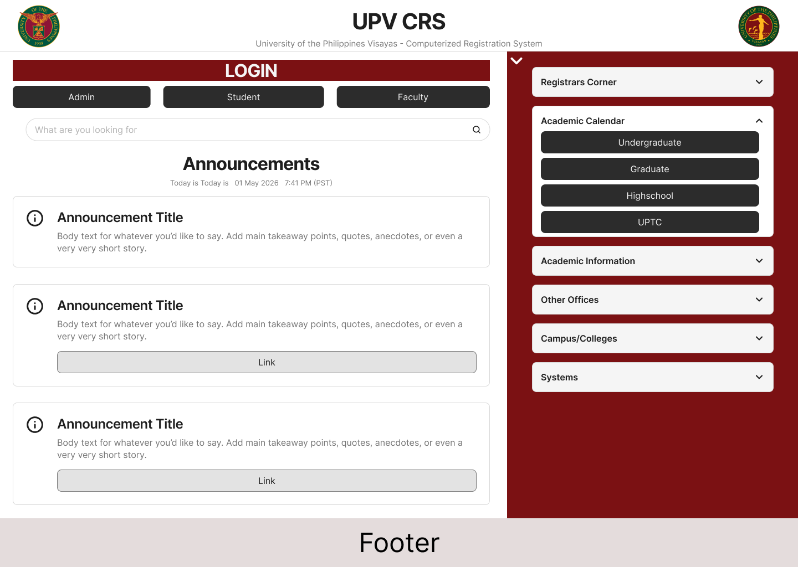
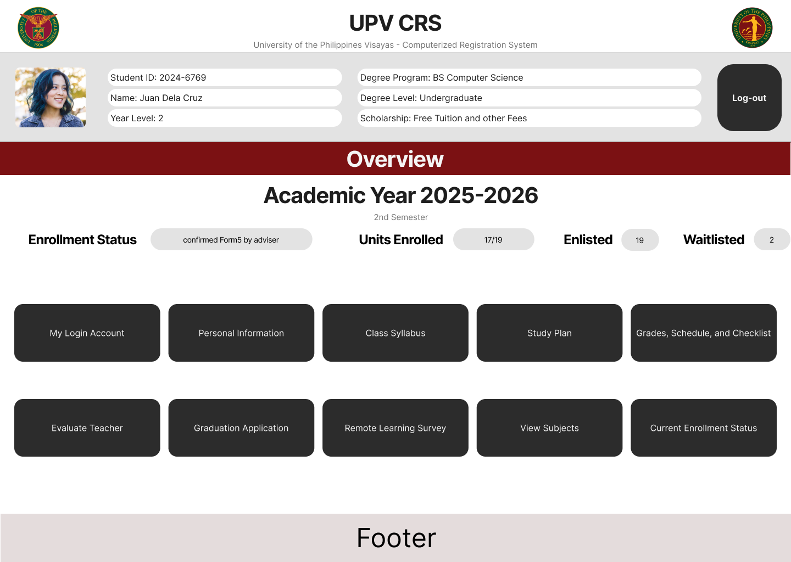
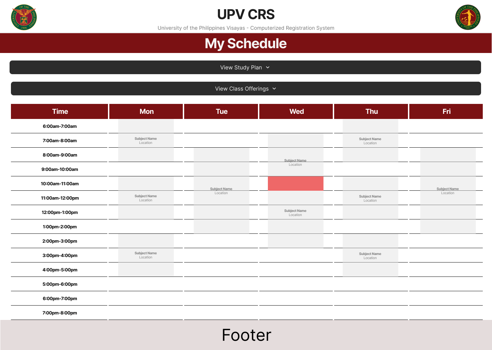
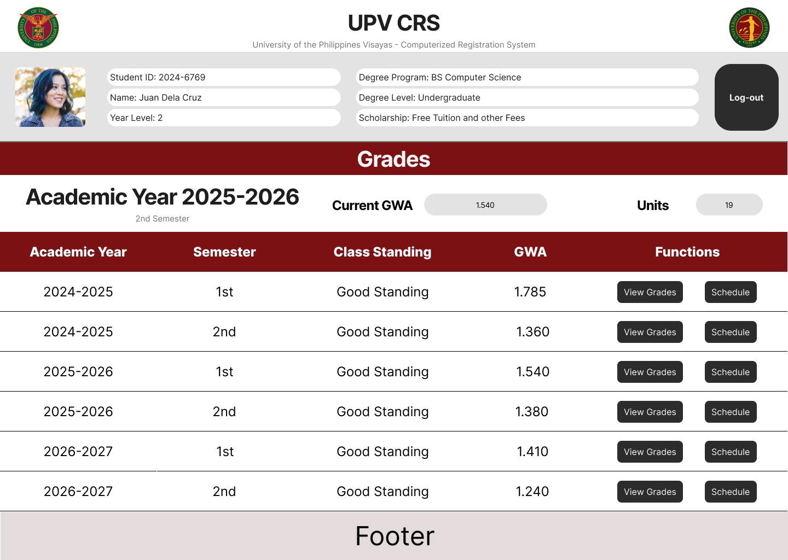

# CMSC126_Activity_Unit5_Unit6

## System Summary
### Team Members
- Junel Arellano
- Yuan Miguel C. Birondo
- Jullian T. Medalla

UPV CRS 2.0 is a proposed modernization of the current Computerized Registration System for the University of the Philippines Visayas. This web application, designed by Yuan's Angels, aims to streamline the registration process, increase user accessibility, and guarantee the complete security of teacher and student data. Our goal is to create a responsive, crash-resistant system that eliminates conflicts and bottlenecks that are frequently encountered during periods of high registration.
In addition to improving backend stability, UPV CRS 2.0 addresses the system's severe UI/UX problems. The current platform sufferers from extreme information overload, outdated layouts, and a total absence of visual hierarchy. Our proposed solution will have a clear and user-friendly dashboard by utilizing React and Tailwind CSS. The overpowering walls of text and links will be replaced with simple navigation in this modern transformation. It aims to guarantee that faculty and students can handle their academic tasks quickly and without frustration.

## Tech Stack
### Frontend Tools
- **React.js**: The front-end interface will be built with React. React is a component-based toolkit that enables us to create dynamic and highly interactive user interfaces, such as real-time scheduling conflict checkers. It functions as a Single Page Application (SPA), which significantly lowers page loading times and gives students a far more seamless, app-like experience while navigating their course schedules. 

### Backend Tools
- **Django**: Django's "batteries-included" approach to security is the main reason we selected it as our backend framework. Django comes with built-in defenses against typical online threats including cross-site scripting (XSS), SQL injection, and cross-site request forgery (CSRF). Prioritizing a highly secure backend system is essential since CRS manages extremely sensitive academic and personal records. 

### Database
- **PostgreSQL**: PostgreSQL will be used for our database. It is a robust, open-source object-relational database system known for its dependability and extensive feature set. Since PostgreSQL is completely ACID-compliant, complicated database transactions—like a student enrolling in many prerequisite-bound courses at once—are handled securely and without data corruption. 

### Other Tools
- **Tailwind**: will be utilized for rapid and efficient UI styling. This guarantees that the platform is fully mobile-responsive, providing a seamless and accessible experience for students accessing the system via their smartphones

## Hosting
We suggest a hybrid hosting strategy that makes use of both local university infrastructure and lightweight cloud services in order to strike a balance between data security, financial restrictions, and system dependability.
 
- **Local On-Premise Backend (Security & Cost Savings)**: Docker will be used to install the Django backend and PostgreSQL database locally on UPV's internal servers. We assure rigorous adherence to data privacy standards and do away with the necessity for costly, ongoing cloud database subscriptions by physically storing critical student and teacher data on campus. Additionally, this localized strategy shields the system from problems with the national budget, such the recent DICT hosting failures due to lack of budget to pay cloud hosting services.
- **Cloud-Distributed Frontend (Accessibility)**: A lightweight Content Delivery Network (CDN), such Vercel or Cloudflare Pages, will host the React frontend. Because the frontend is made up of static files, this hosting is incredibly affordable and guarantees that the user interface loads quickly for students, even during periods of high traffic on the campus network.
- **Resilience and Redundancy**: The local servers will be containerized for quick reboot and recovery in order to reduce the danger of local electricity outages in the Visayas region. To guarantee that the CRS is operational during enrollment periods, the hardware will be supported by the university's secondary generating systems and Uninterruptible Power Supply (UPS).

**Supabase**: Supabase is the open source Postgres development platform that provides a modern, fully managed experience for developers and enterprises. At its core is a scalable, production-ready Postgres database, enhanced with an integrated suite of tools including authentication, storage, edge functions, realtime updates, and vector search. Supabase eliminates the overhead of stitching together backend services and enables teams to focus on building differentiated applications. Developers can launch a project in minutes with CLI, SDKs, or UI, and get access to an instantly available REST and GraphQL API. Enterprise-grade features such as high availability, point-in-time recovery, read replicas, role-based access control, audit logging, and multi-region deployments are available by default. Supabase supports a wide range of Postgres extensions including pgvector, postgis, and Foreign Data Wrappers, and offers full transparency and flexibility through open-source tooling and optional self-hosting. Designed for scale and simplicity, Supabase is trusted by startups and large organizations alike to run mission-critical workloads in production

*Description from https://www.postgresql.org/support/professional_hosting/asia/*

## Mockups
### Home

### Student Information

### Schedule and Conflict Check

### Grades
